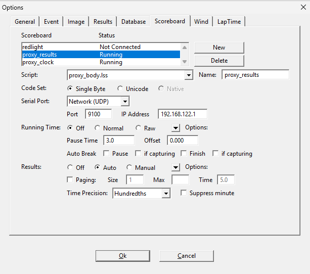

# Lynx -> Websocket Proxy Server

This service takes scoreboard output from FinishLynx and broadcasts it to a websocket. This can be used to easily create an HTML/JS frontend for custom web scoreboards.

## Installation

The server is packaged as a Docker image here: [ghcr.io/mxc42/lynx_to_websocket_proxy](ghcr.io/mxc42/lynx_to_websocket_proxy). A docker compose file is also [provided](./docker-compose.yml).

```
services:
  lynx_ws_proxy:
    image: ghcr.io/mxc42/lynx_to_websocket_proxy:main
    restart: unless-stopped
    ports:
      - $LYNX_BODY_PORT:$LYNX_BODY_PORT/udp
      - $LYNX_CLOCK_PORT:$LYNX_CLOCK_PORT/udp
      - $WS_BODY_PORT:$WS_BODY_PORT/tcp
      - $WS_CLOCK_PORT:$WS_CLOCK_PORT/tcp
    environment:
      - LYNX_BODY_PORT=$LYNX_BODY_PORT
      - LYNX_CLOCK_PORT=$LYNX_CLOCK_PORT
      - WS_BODY_PORT=$WS_BODY_PORT
      - WS_CLOCK_PORT=$WS_CLOCK_PORT
```

Ensure you set the 4 environment variables. An example env file is [provided](./example.env):

```
LYNX_BODY_PORT=9100 // Port to send Lynx UDP results using proxy_body.lss
LYNX_CLOCK_PORT=9101 // Port to send Lynx UDP time using proxy_clock.lss
WS_BODY_PORT=9200 // Websocket port to connect your frontend to receive results.
WS_CLOCK_PORT=9201 // Websocket port to connect your frontend to receive time.
```

Installation via Portainer repostitory is possible using this repository and uploading example.env in the create stack UI.

## Lynx Configuration

Replace `IP Address` in the screeshots with the IP running this server, and `Port` with the ports from your environment variables.

### Results
Using [proxy_body.lss](./lss_files/proxy_body.lss):



### Clock
Using [proxy_clock.lss](./lss_files/proxy_clock.lss):

